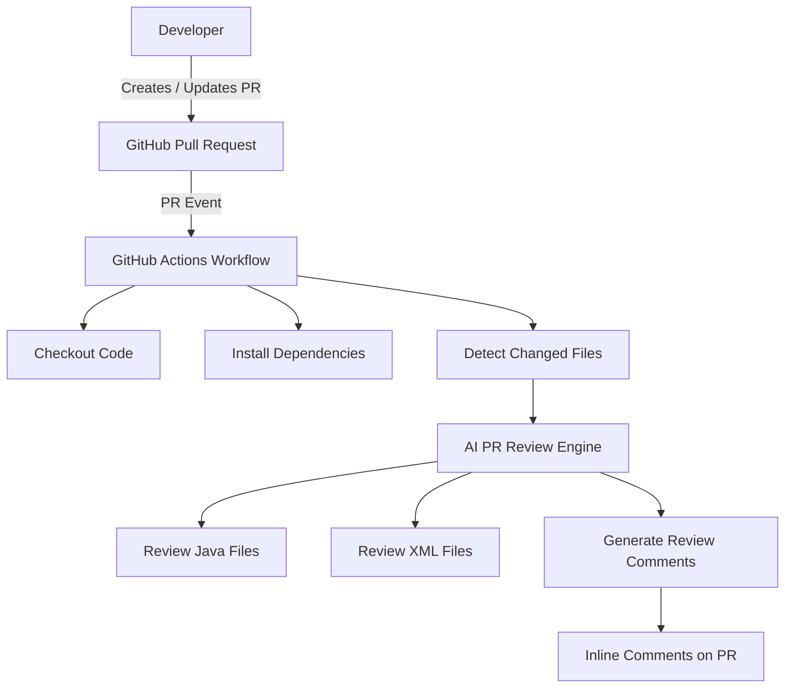
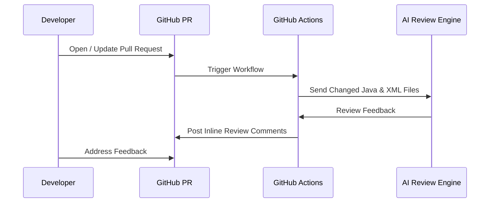

# AI-Powered PR Review Automation


## Overview

**AI-Powered PR Review Automation** is an AI-powered GitHub asset that automatically performs **code reviews for every Pull Request (PR)**.  
For each PR, the workflow analyzes **all modified Java and XML files** and posts **inline review comments** directly on the Pull Request.

The goal is to improve **code quality, consistency, and review efficiency** by providing early, automated feedback before manual reviews begin.

This project is designed to be **lightweight, reusable, and easy to integrate** across repositories and teams.

---

## Why This Project Exists

### Problems with Manual PR Reviews

- Manual reviews are time-consuming and repetitive
- Coding standards enforcement is inconsistent
- Review bottlenecks slow down delivery
- Reviewers focus on basics instead of design and logic

### Solution

Introduce an **AI-driven, automated PR review layer** that:
- Runs automatically on every PR
- Reviews all changed files
- Provides early, actionable feedback
- Complements (not replaces) human reviewers

---

## High-Level Architecture



---

## End-to-End Workflow



---

## Workflow Summary

1. Developer raises or updates a Pull Request  
2. GitHub Action workflow is triggered automatically  
3. Workflow fetches PR details and changed files  
4. Each Java and XML file is sent for AI-based review  
5. Review comments are generated per file  
6. Comments are posted directly on the PR  
7. Developer addresses feedback before manual approval  

---

## Supported File Types

- `.java`
- `.xml`

---

## Repository Structure

```
.
├── .github/
│   └── workflows/
│       └── pr_review.yml
├── PR_Review_OpenAI.py
├── README.md
```

---

## Getting Started

### Prerequisites

- GitHub repository with Actions enabled
- At least one supported LLM API key

### Setup

1. Copy the workflow file to `.github/workflows/pr_review.yml`
2. Add the review script `PR_Review_OpenAI.py`
3. Configure repository secrets
4. Create or update a Pull Request

---

## Configuration & Secrets

| Secret Name | Required | Description |
|------------|----------|-------------|
| `GITHUB_TOKEN` | Yes | GitHub authentication |
| `OPENAI_API_KEY` | Yes | OpenAI API key |
| `CLAUDE_API_KEY` | Optional | Claude support |
| `WATSONX_API_KEY` | Optional | IBM watsonx |
| `WATSONX_PROJECT_ID` | Optional | IBM watsonx project |

---

## Review Output

- Inline comments at file and line level
- Code quality and best practice suggestions
- Refactoring recommendations

---

## Business Impact

- Faster PR review cycles
- Reduced manual review effort
- Improved code quality
- Scalable across teams

---

## Roadmap

- Additional language support
- Configurable rules
- Severity tagging
- Review analytics


## Support

This asset currently supports **GitHub only**.

- Designed to run using **GitHub Actions**
- Triggered by **GitHub Pull Request** events
- Review comments are posted directly on **GitHub Pull Requests**
- Reviews the PRs as per SAP commerce cloud coding Standards


